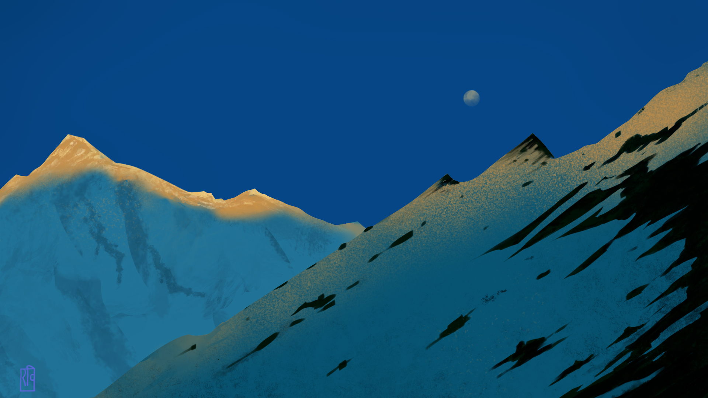
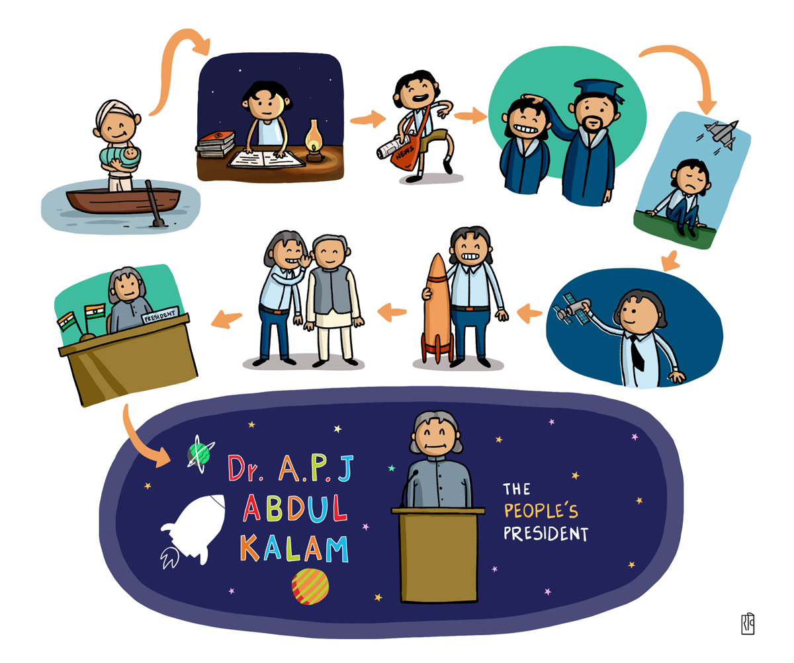
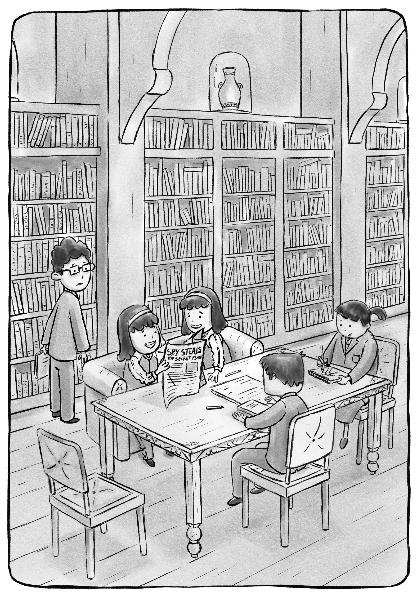
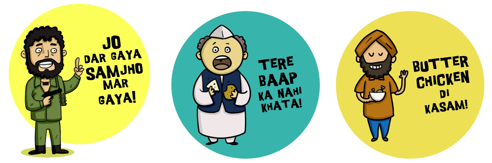
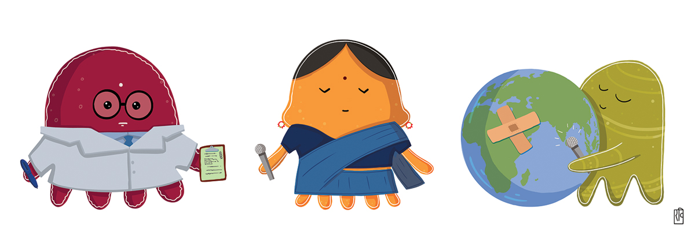

# For - Wacom Designer Spotlight: Ravi Gupta
|  |
|:--:|
| *For FB banner* |
Ravi Gupta is storyteller. He likes to tell stories visually. Either, in the form of an illustration, sequential art, animated film or simply through how a character looks and behaves.
Ravi completed his Graduate Diploma in Animation and Film Design from MIT Institute of Design, Pune. He also holds a Bachelor of Arts Degree with major in English.

As a visual storyteller, he has taken on the roles of a storyboard artist, character designer, motion graphic designer, comic book artist and an art director.

He is currently working on illustrations for the second book of the 'Secret School Mysteries' series written by Ashok Banker and published by Scholastic India. First book from the series titled 'Secret School Mysteries: The Invisible Spy' is available for purchase online.

Wacom products are his tool of choice for Digital Artwork. He owns a 'One by Wacom (CTL-671)' and 'Intuos 4 (PTK-840)'. He currently works with his Wacom tablets on Linux OS (Linux Mint 19.04) and finds that wacom tablets work great out-of-box with Linux. In fact, he worked on the 'Secret School Mysteries: The Invisible Spy' completly with the CTL-671 on Linux Mint using Krita.

His software of choices at present are Krita, Inkscape, Blender 2.8, Clip Studio Paint (on MS Windows).

|  |
|:--:|
| *An Illustration from 'Personality Articles' for Jellyfish Monthly Magazine* |

|  |
|:--:|
| *An Illustration from 'Secret School Mysteries: The Invisible Spy' for Scholastic India* |

|  |
|:--:|
| *Few of the Sticker Designs for Bobble Keyboard App* |

|  |
|:--:|
| *Few of the Mascot Designs for Jellyfish Monthly Magazine* |

|  |
|:--:|
| *An Illustration for a Pattern Design Project for Ghirani.com* |

**You can find more about his work at:** https://www.ravigupta.me/

**He shares the brushes and other digital art resources under pseudonym 'Altback'. You can find his brushes here:** https://altback.com

**Facebook page:** https://www.facebook.com/wowtheskyisblue/

**Instagram page:** https://www.instagram.com/wowtheskyisblue/
